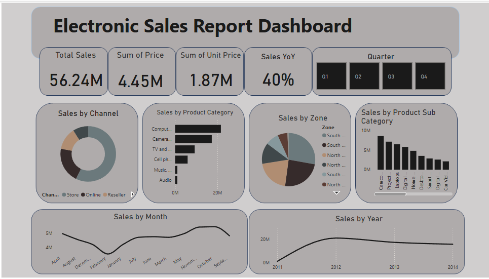

# Electronic Sales Performance Analysis — Power BI Dashboard
 
> Analyzing multi-year electronic sales data to uncover revenue drivers, seasonal patterns, and regional performance using Power BI.
 
---
 
## Table of Contents
 
1. [Project Overview](#project-overview)
2. [Problem Statement](#problem-statement)
3. [Objectives](#objectives)
4. [Tools Used](#tools-used)
5. [Dataset Description](#dataset-description)
6. [Data Cleaning & Transformation](#data-cleaning--transformation)
7. [KPIs & Metrics](#kpis--metrics)
8. [Dashboard Features](#dashboard-features)
9. [Key Insights](#key-insights)
10. [Business Recommendations](#business-recommendations)
11. [Conclusion](#conclusion)
12. [Project Files](#project-files)
---
 
## Project Overview
 
This project analyzes electronic sales data across multiple years, regions, product categories, and sales channels using Power BI. The goal is to move beyond surface-level numbers and answer the questions that actually matter in a sales business: *Which products are driving growth? Where are the strongest markets? When do sales slow down — and what should the business do about it?*
 
The result is an interactive Power BI dashboard that gives sales and business teams a clear, visual view of performance — without needing to dig through spreadsheets.
 
**Dashboard snapshot:**
 

 
---
 
## Problem Statement
 
Many businesses track sales data but struggle to turn it into decisions. Revenue figures sit in spreadsheets, patterns go unnoticed, and strategy is often based on gut feel rather than evidence.
 
This project addresses that gap. Using Power BI, I built an end-to-end analysis that answers:
 
- Which year, region, and product category drive the most revenue?
- How much has the business grown year-over-year?
- Are there seasonal patterns the business should plan around?
- Which sales channel performs best — stores, online, or resellers?
---
 
## Objectives
 
- Analyze year-on-year sales trends and calculate growth rates
- Identify the highest and lowest performing time periods
- Determine the best-performing product categories and subcategories
- Compare performance across geographic regions
- Evaluate sales channel effectiveness (store, online, reseller)
- Implement time intelligence measures — YoY growth, YTD sales, previous year comparison
- Deliver data-driven recommendations for the business
---
 
## Tools Used
 
| Tool | How It Was Used |
|---|---|
| **Power BI** | Dashboard development, interactive visuals, and reporting |
| **Power Query** | Data cleaning, transformation, and shaping |
| **DAX** | Calculated measures — YoY growth, YTD sales, previous year comparisons |
 
---
 
## Dataset Description
 
The dataset contains electronic product sales transaction records covering multiple years (2011–2014). Key fields include:
 
| Field | Description |
|---|---|
| Sale Date | Transaction date (used to build year/month/quarter hierarchy) |
| Product Category | High-level product grouping (e.g., Computers, Cameras) |
| Product Subcategory | More granular product grouping (e.g., Camcorders, Laptops) |
| Sales Channel | How the sale was made — Store, Online, or Reseller |
| Zone / Region | Geographic sales region |
| Unit Price | Price per unit |
| Total Sales | Revenue generated per transaction |
 
**Summary figures from the dashboard:**
 
| Metric | Value |
|---|---|
| Total Sales | $56.24M |
| Sum of Unit Price | $1.87M |
| Sum of Price | $4.45M |
| Year-over-Year Growth | 40% |
 
---
 
## Data Cleaning & Transformation
 
All cleaning was done in Power Query before any analysis began. Steps included:
 
- **Removed duplicate records** to prevent inflated sales figures
- **Checked and handled missing values** across key fields
- **Corrected data types** — especially date columns that were stored as text
- **Created a date hierarchy** (Year → Quarter → Month) to enable time intelligence analysis in DAX
- **Structured and renamed columns** for consistency and readability in visuals
These steps ensured the data was reliable before a single chart was built.
 
---
 
## KPIs & Metrics
 
The following KPIs were developed using DAX and featured on the dashboard:
 
| KPI | Description |
|---|---|
| **Total Sales** | Overall revenue across all years, regions, and channels |
| **YTD Sales** | Cumulative sales from the start of the year to a selected date |
| **Previous Year Sales** | Total revenue in the prior year — used as the YoY baseline |
| **Year-over-Year Growth** | % change in revenue vs. the prior year (**40% growth recorded**) |
| **Sales by Year** | Annual revenue breakdown |
| **Sales by Region (Zone)** | Revenue by geographic area |
| **Sales by Category** | Revenue by product category |
| **Sales by Subcategory** | Revenue by product subcategory |
| **Sales by Month** | Monthly revenue trend |
| **Sales by Channel** | Revenue split by Store, Online, and Reseller |
 
---
 
## Dashboard Features
 
The Power BI dashboard is fully interactive and includes:
 
- **KPI summary cards** at the top — Total Sales, Sum of Price, Sum of Unit Price, and YoY Growth visible at a glance
- **Quarter slicer** (Q1/Q2/Q3/Q4) — filter all visuals by quarter in one click
- **Sales by Channel** — horizontal bar chart comparing Store, Online, and Reseller performance
- **Sales by Product Category** — bar chart ranking all categories by revenue
- **Sales by Zone (Region)** — donut chart showing regional revenue distribution
- **Sales by Product Subcategory** — bar chart for granular product-level comparison
- **Sales by Month** — line chart showing the full monthly sales trend across the year
- **Sales by Year** — bar chart comparing annual revenue from 2011 to 2014
All visuals are cross-filtered — clicking any data point updates every other chart on the page automatically.
 
---
 
## Key Insights
 
### Sales Growth
- The business recorded **40% Year-over-Year growth**, signaling strong and sustained expansion
- **2012 was the highest-performing year**; 2011 was the weakest — the gap between them shows how quickly the business scaled
### Regional Performance
- The **South East region generated the highest sales** across all years
- Other regions trail significantly, suggesting uneven market penetration
### Product Performance
- **Computers** is the top-performing category — the clear revenue engine of the business
- **Camcorders** lead at the subcategory level, contributing a notable share of total revenue
### Seasonal Patterns
- **October is the peak sales month** — likely driven by back-to-school and pre-holiday purchasing behavior
- **February consistently records the lowest sales** — the quietest period in the business calendar
### Sales Channels
- **Physical stores generate the most sales**, making in-store experience a critical business asset
- Online and reseller channels are active but secondary — an opportunity area
---
 
## Business Recommendations
 
**1. Double down on Computers**
It is the top revenue category by a clear margin. Prioritize it in inventory planning, promotions, and sales training. Protecting margin here matters more than growing other categories.
 
**2. Invest in underperforming regions**
The South East leads, but the gap with other regions is significant. Investigate whether the issue is market awareness, distribution, pricing, or sales rep coverage — then address it directly.
 
**3. Run targeted promotions in February**
February's sales dip is consistent and predictable. That makes it plannable. A well-timed promotion, bundle deal, or campaign in late January could meaningfully lift the worst month on the calendar.
 
**4. Capitalize on October demand**
October is the peak month — make sure stock levels, staffing, and marketing budgets are aligned to capture every sale available during this window.
 
**5. Grow the online channel**
Stores dominate today, but online channels offer scale without proportional cost increases. Even modest investment in online sales infrastructure could improve total revenue without adding physical footprint.
 
**6. Study and replicate what's working in the South East**
The best-performing region likely has lessons worth sharing — sales strategies, customer relationships, or pricing practices that other regions could adopt.
 
---
 
## Conclusion
 
This analysis turned raw sales transaction data into a clear picture of business performance. The 40% Year-over-Year growth is the headline, but the real value is in the detail — knowing *which* products, *which* regions, and *which* time periods are driving (and dragging) that number.
 
The dashboard makes this information accessible to anyone in the business, not just data analysts. A sales manager can filter by quarter and immediately see what happened. A product team can check subcategory performance in seconds.
 
That's what good data work does — it removes the guesswork.
 
---
 
## Project Files
 
```
electronic-sales-powerbi-analysis/
│
├── README.md                              ← You are here
├── Electronic_Sales_Dashboard.pbix        ← Power BI dashboard file
├── Power_BI_Analysis_Report.pdf           ← Full project report
└── screenshots/
    └── dashboard_overview.png             ← Dashboard screenshot
```
 
> **To view the dashboard:** Download `Electronic_Sales_Dashboard.pbix` and open it in [Power BI Desktop](https://powerbi.microsoft.com/desktop/) — free to download and install.
 
---
 
*Project by Fadare Favour | Statistics Undergraduate | Data Analytics & Business Intelligence*
